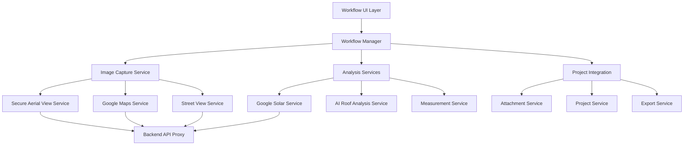
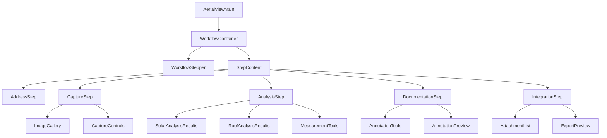

# Design Document

## Overview

The enhanced aerial view and site analysis feature will transform the existing basic functionality into a comprehensive, workflow-driven toolset for electrical professionals. The design focuses on creating a guided, step-by-step process that systematically captures, analyzes, and integrates site data into the project management system. The architecture leverages existing services while adding new workflow orchestration, enhanced UI components, and seamless project integration.

## Architecture

### High-Level Architecture



### Component Hierarchy



## Components and Interfaces

### 1. Workflow Management System

#### WorkflowManager
```typescript
interface WorkflowStep {
  id: string;
  name: string;
  description: string;
  component: React.ComponentType;
  isComplete: boolean;
  isRequired: boolean;
  validationRules: ValidationRule[];
  dependencies: string[];
}

interface WorkflowState {
  currentStep: number;
  steps: WorkflowStep[];
  completedSteps: Set<string>;
  canAdvance: boolean;
  canGoBack: boolean;
}

class WorkflowManager {
  validateStep(stepId: string): Promise<ValidationResult>;
  advanceToNextStep(): Promise<void>;
  goToPreviousStep(): void;
  jumpToStep(stepId: string): Promise<void>;
  getStepProgress(): number;
  resetWorkflow(): void;
}
```

#### WorkflowStepper Component
```typescript
interface WorkflowStepperProps {
  steps: WorkflowStep[];
  currentStep: number;
  onStepClick: (stepIndex: number) => void;
  showProgress: boolean;
}
```

### 2. Enhanced Image Capture System

#### MultiZoomImageCapture
```typescript
interface ImageCaptureOptions {
  zoomLevels: number[];
  imageSize: { width: number; height: number };
  provider: 'google' | 'mapbox';
  refreshInterval?: number;
}

interface CapturedImage {
  id: string;
  type: 'satellite' | 'street_view';
  url: string;
  zoom?: number;
  heading?: number;
  metadata: ImageMetadata;
  captureTime: Date;
  status: 'loading' | 'success' | 'error';
}

class ImageCaptureService {
  captureMultiZoomSatellite(coordinates: Coordinates, options: ImageCaptureOptions): Promise<CapturedImage[]>;
  captureMultiAngleStreetView(coordinates: Coordinates): Promise<CapturedImage[]>;
  refreshImage(imageId: string): Promise<CapturedImage>;
  bulkRefresh(imageIds: string[]): Promise<CapturedImage[]>;
}
```

#### ImageGallery Component
```typescript
interface ImageGalleryProps {
  images: CapturedImage[];
  onImageSelect: (image: CapturedImage) => void;
  onImageRefresh: (imageId: string) => void;
  onBulkRefresh: () => void;
  selectedImageId?: string;
  showMetadata: boolean;
}
```

### 3. Integrated Analysis System

#### AnalysisOrchestrator
```typescript
interface AnalysisRequest {
  type: 'solar' | 'roof' | 'combined';
  imageUrl: string;
  coordinates: Coordinates;
  options: AnalysisOptions;
}

interface AnalysisResult {
  id: string;
  type: string;
  status: 'pending' | 'processing' | 'complete' | 'error';
  data: any;
  confidence: number;
  processingTime: number;
  createdAt: Date;
}

class AnalysisOrchestrator {
  requestAnalysis(request: AnalysisRequest): Promise<string>;
  getAnalysisResult(analysisId: string): Promise<AnalysisResult>;
  combineAnalysisResults(results: AnalysisResult[]): Promise<CombinedAnalysis>;
  exportAnalysisReport(analysisId: string): Promise<Blob>;
}
```

#### Enhanced Solar Analysis
```typescript
interface EnhancedSolarAnalysis extends SolarAnalysisResult {
  roofSegments: RoofSegment[];
  panelLayout: PanelPlacement[];
  shadingAnalysis: ShadingData;
  financialProjection: {
    systemCost: number;
    annualSavings: number;
    paybackPeriod: number;
    roi: number;
  };
}
```

### 4. Advanced Measurement and Annotation Tools

#### MeasurementEngine
```typescript
interface MeasurementTool {
  type: 'linear' | 'area' | 'angle';
  unit: 'feet' | 'meters';
  precision: number;
  snapToGrid: boolean;
}

interface Measurement {
  id: string;
  type: string;
  points: Point[];
  value: number;
  unit: string;
  label: string;
  accuracy: number;
  metadata: MeasurementMetadata;
}

class MeasurementEngine {
  createMeasurement(tool: MeasurementTool, points: Point[]): Measurement;
  calculateDistance(point1: Point, point2: Point, imageMetadata: ImageMetadata): number;
  calculateArea(points: Point[], imageMetadata: ImageMetadata): number;
  convertUnits(value: number, fromUnit: string, toUnit: string): number;
  validateMeasurement(measurement: Measurement): ValidationResult;
}
```

#### AnnotationSystem
```typescript
interface Annotation {
  id: string;
  type: 'electrical_panel' | 'meter' | 'conduit' | 'obstacle' | 'note';
  position: Point;
  size: { width: number; height: number };
  label: string;
  color: string;
  notes: string;
  metadata: AnnotationMetadata;
}

interface AnnotationTemplate {
  type: string;
  defaultSize: { width: number; height: number };
  defaultColor: string;
  icon: string;
  properties: AnnotationProperty[];
}

class AnnotationSystem {
  createAnnotation(template: AnnotationTemplate, position: Point): Annotation;
  updateAnnotation(id: string, updates: Partial<Annotation>): void;
  deleteAnnotation(id: string): void;
  exportAnnotations(format: 'json' | 'svg' | 'pdf'): Promise<Blob>;
}
```

### 5. Project Integration Layer

#### AttachmentIntegration
```typescript
interface AerialViewAttachment extends ProjectAttachment {
  aerialViewData: {
    coordinates: Coordinates;
    zoom: number;
    heading?: number;
    analysisResults?: AnalysisResult[];
    measurements?: Measurement[];
    annotations?: Annotation[];
  };
}

class AttachmentIntegration {
  createAerialViewAttachment(
    projectId: string,
    image: CapturedImage,
    analysisData?: AnalysisResult[]
  ): Promise<AerialViewAttachment>;
  
  updateAttachmentWithAnalysis(
    attachmentId: string,
    analysisResult: AnalysisResult
  ): Promise<void>;
  
  generateSiteAnalysisReport(projectId: string): Promise<SiteAnalysisReport>;
  addToProjectPlanSet(projectId: string, attachmentIds: string[]): Promise<void>;
}
```

#### ProjectPlanSetIntegration
```typescript
interface SiteAnalysisSection {
  title: string;
  satelliteImages: AerialViewAttachment[];
  streetViewImages: AerialViewAttachment[];
  analysisResults: AnalysisResult[];
  measurements: Measurement[];
  annotations: Annotation[];
  summary: string;
}

class ProjectPlanSetIntegration {
  addSiteAnalysisSection(projectId: string, section: SiteAnalysisSection): Promise<void>;
  updateSiteAnalysisSection(projectId: string, updates: Partial<SiteAnalysisSection>): Promise<void>;
  generateSiteAnalysisPDF(projectId: string): Promise<Blob>;
}
```

## Data Models

### Workflow State Model
```typescript
interface AerialViewWorkflowState {
  workflowId: string;
  projectId: string;
  currentStep: WorkflowStepId;
  stepData: {
    address: AddressStepData;
    capture: CaptureStepData;
    analysis: AnalysisStepData;
    documentation: DocumentationStepData;
    integration: IntegrationStepData;
  };
  completedSteps: Set<WorkflowStepId>;
  createdAt: Date;
  lastModified: Date;
}
```

### Enhanced Image Metadata
```typescript
interface ImageMetadata {
  coordinates: Coordinates;
  zoom: number;
  heading?: number;
  resolution: number; // meters per pixel
  captureDate: Date;
  provider: string;
  imageSize: { width: number; height: number };
  quality: 'low' | 'medium' | 'high';
  cacheExpiry: Date;
}
```

### Analysis Data Models
```typescript
interface CombinedAnalysis {
  solarAnalysis: EnhancedSolarAnalysis;
  roofAnalysis: RoofAnalysisResult;
  measurements: Measurement[];
  annotations: Annotation[];
  summary: {
    totalRoofArea: number;
    usableSolarArea: number;
    estimatedPanelCount: number;
    annualEnergyProduction: number;
    electricalRequirements: ElectricalRequirement[];
  };
}
```

## Error Handling

### Error Recovery System
```typescript
interface ErrorRecoveryStrategy {
  errorType: string;
  retryAttempts: number;
  fallbackAction: () => Promise<void>;
  userMessage: string;
  technicalDetails: string;
}

class ErrorRecoveryManager {
  handleApiError(error: ApiError): Promise<void>;
  handleImageLoadError(imageId: string): Promise<void>;
  handleAnalysisError(analysisId: string): Promise<void>;
  showUserFriendlyError(error: Error): void;
  logTechnicalError(error: Error, context: string): void;
}
```

### Offline Support
```typescript
interface OfflineCapability {
  cacheImages: boolean;
  cacheAnalysisResults: boolean;
  allowOfflineAnnotation: boolean;
  syncOnReconnect: boolean;
}

class OfflineManager {
  cacheImageData(images: CapturedImage[]): Promise<void>;
  getCachedImages(coordinates: Coordinates): Promise<CapturedImage[]>;
  queueOfflineActions(actions: OfflineAction[]): void;
  syncWhenOnline(): Promise<void>;
}
```

## Testing Strategy

### Unit Testing
- Workflow state management
- Image capture service methods
- Analysis result processing
- Measurement calculations
- Annotation system operations

### Integration Testing
- API service integration
- Project attachment workflow
- Export functionality
- Error handling scenarios

### End-to-End Testing
- Complete workflow execution
- Multi-device responsiveness
- Performance under load
- Offline/online transitions

### Performance Testing
- Image loading optimization
- Analysis processing time
- Memory usage with TensorFlow.js
- Large dataset handling

## Security Considerations

### API Security
- All external API calls through secure backend proxy
- API key protection and rotation
- Rate limiting and request validation
- CORS and CSP headers

### Data Privacy
- Image data encryption in transit
- Temporary image storage with automatic cleanup
- User consent for data processing
- GDPR compliance for EU users

### Input Validation
- Address input sanitization
- Image URL validation
- Coordinate boundary checking
- File upload restrictions