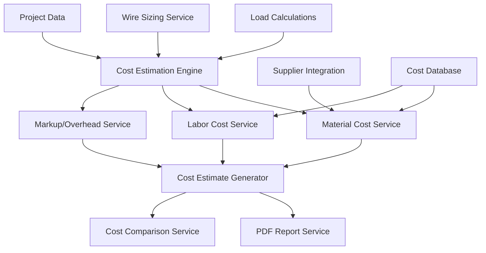

# Design Document

## Overview

The Cost Estimation feature will provide electrical professionals with comprehensive project cost calculations by integrating with existing load calculations, wire sizing, and project data. The system will automatically generate material lists, calculate labor costs, apply markup and overhead, and produce professional cost estimate reports. This feature leverages the existing project structure and calculation services while introducing new cost-specific services and components.

## Architecture

### High-Level Architecture



### Integration Points

The cost estimation feature integrates with existing services:
- **NEC Calculations Service**: Source of load requirements and wire specifications
- **Wire Calculations Service**: Provides conductor sizing and material requirements
- **Project Service**: Stores cost estimates and project-specific pricing
- **PDF Export Service**: Generates formatted cost estimate reports
- **Validation Service**: Ensures cost calculation accuracy

## Components and Interfaces

### Core Types

```typescript
// Cost Estimation Types
export interface MaterialItem {
  id: string;
  name: string;
  category: 'wire' | 'conduit' | 'panel' | 'breaker' | 'device' | 'misc';
  partNumber?: string;
  manufacturer?: string;
  unit: 'ft' | 'ea' | 'lb' | 'box' | 'roll';
  unitCost: number;
  quantity: number;
  totalCost: number;
  supplier?: string;
  lastUpdated: string;
}

export interface LaborItem {
  id: string;
  description: string;
  category: 'installation' | 'testing' | 'cleanup' | 'travel' | 'permit';
  hours: number;
  rate: number;
  skillLevel: 'apprentice' | 'journeyman' | 'master' | 'foreman';
  totalCost: number;
}

export interface CostEstimate {
  id: string;
  projectId: string;
  name: string;
  created: string;
  modified: string;
  materials: MaterialItem[];
  labor: LaborItem[];
  subtotals: {
    materials: number;
    labor: number;
    subtotal: number;
  };
  markup: {
    materialMarkup: number;
    laborMarkup: number;
    overhead: number;
    profit: number;
  };
  totals: {
    materialTotal: number;
    laborTotal: number;
    overheadTotal: number;
    profitTotal: number;
    grandTotal: number;
  };
  settings: CostEstimateSettings;
  scenarios: CostScenario[];
  actualCosts?: ActualCostTracking;
}

export interface CostEstimateSettings {
  materialMarkupPercent: number;
  laborMarkupPercent: number;
  overheadPercent: number;
  profitPercent: number;
  regionalMultiplier: number;
  laborRates: {
    apprentice: number;
    journeyman: number;
    master: number;
    foreman: number;
  };
  supplierPreferences: string[];
}

export interface CostScenario {
  id: string;
  name: string;
  description: string;
  materialAdjustments: MaterialAdjustment[];
  laborAdjustments: LaborAdjustment[];
  totalDifference: number;
  percentDifference: number;
}

export interface ActualCostTracking {
  materialActual: number;
  laborActual: number;
  totalActual: number;
  variance: {
    material: number;
    labor: number;
    total: number;
    materialPercent: number;
    laborPercent: number;
    totalPercent: number;
  };
  notes: string;
}
```

### Service Layer

#### CostEstimationService
Primary service orchestrating cost calculations:

```typescript
export class CostEstimationService {
  // Generate cost estimate from project data
  generateEstimate(projectData: ProjectData): Promise<CostEstimate>
  
  // Update existing estimate
  updateEstimate(estimateId: string, updates: Partial<CostEstimate>): Promise<CostEstimate>
  
  // Create scenario comparison
  createScenario(estimateId: string, scenario: CostScenario): Promise<CostEstimate>
  
  // Track actual costs against estimate
  trackActualCosts(estimateId: string, actualCosts: ActualCostTracking): Promise<CostEstimate>
}
```

#### MaterialCostService
Handles material identification and pricing:

```typescript
export class MaterialCostService {
  // Generate material list from calculations
  generateMaterialList(calculations: CalculationResults, wireResults: WireSizeResult[]): MaterialItem[]
  
  // Update material pricing from suppliers
  updatePricing(materials: MaterialItem[]): Promise<MaterialItem[]>
  
  // Get alternative materials for cost comparison
  getAlternatives(materialId: string): Promise<MaterialItem[]>
  
  // Cache pricing data
  cachePricing(materials: MaterialItem[]): void
}
```

#### LaborCostService
Calculates labor requirements and costs:

```typescript
export class LaborCostService {
  // Calculate labor hours based on project scope
  calculateLaborHours(materials: MaterialItem[], projectComplexity: number): LaborItem[]
  
  // Apply regional labor rate adjustments
  applyRegionalRates(labor: LaborItem[], region: string): LaborItem[]
  
  // Calculate specialized work multipliers
  applySkillMultipliers(labor: LaborItem[]): LaborItem[]
}
```

#### SupplierIntegrationService
Manages supplier data and pricing updates:

```typescript
export class SupplierIntegrationService {
  // Fetch current pricing from suppliers
  fetchPricing(partNumbers: string[]): Promise<MaterialPricing[]>
  
  // Compare prices across suppliers
  comparePricing(materialId: string): Promise<SupplierComparison[]>
  
  // Handle supplier API failures gracefully
  handleSupplierFailure(supplierId: string): void
}
```

### UI Components

#### CostEstimationPanel
Main interface for cost estimation:

```typescript
interface CostEstimationPanelProps {
  projectData: ProjectData;
  calculations: CalculationResults;
  onEstimateGenerated: (estimate: CostEstimate) => void;
}
```

#### MaterialListEditor
Allows manual material adjustments:

```typescript
interface MaterialListEditorProps {
  materials: MaterialItem[];
  onMaterialUpdate: (materialId: string, updates: Partial<MaterialItem>) => void;
  onMaterialAdd: (material: MaterialItem) => void;
  onMaterialRemove: (materialId: string) => void;
}
```

#### CostScenarioComparison
Side-by-side scenario comparison:

```typescript
interface CostScenarioComparisonProps {
  baseEstimate: CostEstimate;
  scenarios: CostScenario[];
  onScenarioSelect: (scenarioId: string) => void;
}
```

#### CostReportGenerator
Professional report generation interface:

```typescript
interface CostReportGeneratorProps {
  estimate: CostEstimate;
  projectInfo: ProjectInformation;
  reportType: 'detailed' | 'summary' | 'client';
  onReportGenerated: (reportData: Blob) => void;
}
```

## Data Models

### Material Database Schema

The system will maintain a local material database with the following structure:

```typescript
interface MaterialDatabase {
  wire: {
    [size: string]: {
      copper: MaterialPricing;
      aluminum: MaterialPricing;
    };
  };
  conduit: {
    [type: string]: {
      [size: string]: MaterialPricing;
    };
  };
  panels: {
    [amperage: string]: {
      [phases: string]: MaterialPricing[];
    };
  };
  breakers: {
    [amperage: string]: {
      [type: string]: MaterialPricing;
    };
  };
  devices: {
    [category: string]: MaterialPricing[];
  };
}

interface MaterialPricing {
  partNumber: string;
  manufacturer: string;
  description: string;
  unitCost: number;
  unit: string;
  supplier: string;
  lastUpdated: string;
  availability: 'in-stock' | 'special-order' | 'discontinued';
}
```

### Cost Calculation Logic

#### Material Quantity Calculation

```typescript
// Wire quantity calculation
const calculateWireQuantity = (
  circuits: CircuitData[],
  averageRunLength: number = 50
): MaterialItem[] => {
  return circuits.map(circuit => ({
    id: `wire-${circuit.id}`,
    name: `${circuit.wireSize} ${circuit.material} Wire`,
    category: 'wire',
    unit: 'ft',
    quantity: circuit.quantity * averageRunLength * 1.1, // 10% waste factor
    unitCost: getWireUnitCost(circuit.wireSize, circuit.material),
    totalCost: 0 // Calculated after unit cost lookup
  }));
};
```

#### Labor Hour Calculation

```typescript
// Labor calculation based on material complexity
const calculateInstallationHours = (materials: MaterialItem[]): LaborItem[] => {
  const laborFactors = {
    wire: 0.1, // hours per foot
    conduit: 0.15, // hours per foot
    panel: 8, // hours per panel
    breaker: 0.5, // hours per breaker
    device: 0.25 // hours per device
  };
  
  return materials.map(material => ({
    id: `labor-${material.id}`,
    description: `Install ${material.name}`,
    category: 'installation',
    hours: material.quantity * laborFactors[material.category],
    rate: getLaborRate('journeyman'),
    skillLevel: 'journeyman',
    totalCost: 0 // Calculated after rate lookup
  }));
};
```

## Error Handling

### Cost Calculation Errors

```typescript
export class CostCalculationError extends Error {
  constructor(
    message: string,
    public code: string,
    public context: any
  ) {
    super(message);
    this.name = 'CostCalculationError';
  }
}

// Error codes
export const COST_ERROR_CODES = {
  MATERIAL_NOT_FOUND: 'COST-001',
  PRICING_UNAVAILABLE: 'COST-002',
  SUPPLIER_TIMEOUT: 'COST-003',
  INVALID_MARKUP: 'COST-004',
  CALCULATION_OVERFLOW: 'COST-005'
} as const;
```

### Graceful Degradation

- **Supplier API Failures**: Fall back to cached pricing with warning
- **Missing Material Data**: Use generic pricing with user notification
- **Calculation Errors**: Provide partial results with error indicators
- **Network Issues**: Enable offline mode with local data

## Testing Strategy

### Unit Tests

1. **Material Calculation Tests**
   - Wire quantity calculations from load data
   - Conduit sizing based on wire fill
   - Panel and breaker selection logic

2. **Labor Calculation Tests**
   - Hour calculations for different material types
   - Regional rate adjustments
   - Skill level multipliers

3. **Cost Calculation Tests**
   - Markup and overhead applications
   - Scenario comparison calculations
   - Variance tracking accuracy

### Integration Tests

1. **Service Integration**
   - Cost estimation with NEC calculations
   - Wire sizing integration
   - Project data persistence

2. **Supplier Integration**
   - API response handling
   - Pricing update workflows
   - Fallback mechanisms

### End-to-End Tests

1. **Complete Estimation Workflow**
   - Generate estimate from project
   - Create and compare scenarios
   - Export professional reports

2. **Cost Tracking Workflow**
   - Enter actual costs
   - Calculate variances
   - Generate accuracy reports

## Performance Considerations

### Optimization Strategies

1. **Lazy Loading**: Load material database on demand
2. **Caching**: Cache supplier pricing for 24 hours
3. **Debouncing**: Debounce real-time cost updates during editing
4. **Background Processing**: Calculate complex scenarios asynchronously

### Memory Management

- Limit material database size to essential items
- Implement LRU cache for supplier pricing
- Clean up old estimate data periodically
- Use virtual scrolling for large material lists

## Security Considerations

### Data Protection

- Encrypt sensitive pricing data in local storage
- Sanitize supplier API responses
- Validate all cost calculation inputs
- Implement rate limiting for supplier API calls

### Access Control

- Restrict cost estimation to authenticated users
- Implement role-based access for pricing data
- Audit trail for cost estimate modifications
- Secure supplier API key management

## Accessibility

### WCAG Compliance

- Keyboard navigation for all cost estimation interfaces
- Screen reader support for cost calculations
- High contrast mode for cost comparison tables
- Alternative text for cost charts and graphs

### Usability Features

- Clear cost breakdown hierarchies
- Consistent currency formatting
- Intuitive scenario comparison layouts
- Helpful tooltips for complex calculations