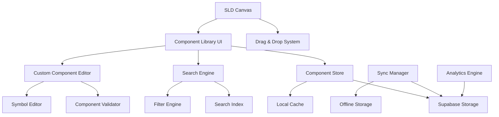

# Design Document

## Overview

The Enhanced SLD Component Library will be a modern, cloud-enabled component management system that transforms the current basic component library into a professional-grade tool for electrical design. The system will leverage Supabase for cloud storage, implement advanced search and filtering capabilities, support custom component creation, and provide seamless integration with the existing SLD canvas.

The design focuses on creating an intuitive user experience that reduces friction in component selection while providing powerful features for professional electrical designers. The architecture will be modular, scalable, and maintainable, following React best practices and modern UX patterns.

## Architecture

### High-Level Architecture



### Component Architecture

The system will be built using a layered architecture:

1. **Presentation Layer**: React components with modern UI patterns
2. **Business Logic Layer**: Custom hooks and service classes
3. **Data Access Layer**: Supabase integration with local caching
4. **Storage Layer**: Cloud storage with offline capabilities

### Data Flow

1. **Component Loading**: Components are loaded from Supabase with local caching for performance
2. **Search & Filter**: Real-time search uses indexed data with fuzzy matching
3. **Custom Components**: Created locally, validated, then synced to cloud
4. **Drag & Drop**: Components are serialized and passed to the SLD canvas
5. **Sync**: Changes are automatically synced with conflict resolution

## Components and Interfaces

### Core Components

#### ComponentLibraryPanel
Main container component that orchestrates the entire library interface.

```typescript
interface ComponentLibraryPanelProps {
  isOpen: boolean;
  onClose: () => void;
  onComponentSelect: (component: SLDComponent) => void;
  onComponentDrag: (component: SLDComponent, event: DragEvent) => void;
  position: 'left' | 'right' | 'bottom' | 'floating';
  size: 'compact' | 'normal' | 'expanded';
}
```

#### ComponentGrid
Virtualized grid display for efficient rendering of large component libraries.

```typescript
interface ComponentGridProps {
  components: ComponentLibraryItem[];
  selectedIds: string[];
  onSelect: (id: string) => void;
  onDoubleClick: (component: ComponentLibraryItem) => void;
  viewMode: 'grid' | 'list' | 'compact';
  itemSize: number;
}
```

#### ComponentCard
Individual component display with preview, specifications, and actions.

```typescript
interface ComponentCardProps {
  component: ComponentLibraryItem;
  isSelected: boolean;
  viewMode: 'grid' | 'list' | 'compact';
  onSelect: () => void;
  onDoubleClick: () => void;
  onDragStart: (event: DragEvent) => void;
  showDetails: boolean;
}
```

#### SearchAndFilter
Advanced search interface with real-time filtering and suggestions.

```typescript
interface SearchAndFilterProps {
  onSearch: (query: string) => void;
  onFilter: (filters: ComponentFilters) => void;
  filters: ComponentFilters;
  suggestions: string[];
  recentSearches: string[];
}
```

#### CustomComponentEditor
Visual editor for creating and modifying custom components.

```typescript
interface CustomComponentEditorProps {
  component?: ComponentLibraryItem;
  isOpen: boolean;
  onSave: (component: ComponentLibraryItem) => void;
  onCancel: () => void;
  templates: ComponentTemplate[];
}
```

### Data Interfaces

#### ComponentLibraryItem
Extended component definition with library-specific metadata.

```typescript
interface ComponentLibraryItem {
  id: string;
  name: string;
  description: string;
  category: ComponentCategory;
  subcategory: string;
  manufacturer?: string;
  model?: string;
  
  // Visual representation
  symbol: ComponentSymbol;
  thumbnail: string;
  preview: ComponentPreview;
  
  // Electrical specifications
  specifications: ComponentSpecifications;
  ratings: ElectricalRatings;
  terminals: ComponentTerminal[];
  
  // NEC compliance
  necCompliant: boolean;
  necReferences: string[];
  requiredLabels: string[];
  
  // Library metadata
  isCustom: boolean;
  isShared: boolean;
  createdBy?: string;
  createdAt: Date;
  lastModified: Date;
  usageCount: number;
  tags: string[];
  
  // Cloud sync
  cloudId?: string;
  syncStatus: 'synced' | 'pending' | 'conflict' | 'error';
  version: number;
}
```

#### ComponentFilters
Comprehensive filtering options for component discovery.

```typescript
interface ComponentFilters {
  categories: ComponentCategory[];
  manufacturers: string[];
  voltageRange: [number, number];
  currentRange: [number, number];
  necCompliant?: boolean;
  customOnly?: boolean;
  sharedOnly?: boolean;
  tags: string[];
  dateRange?: [Date, Date];
}
```

#### ComponentSymbol
IEEE standard symbol representation with customization options.

```typescript
interface ComponentSymbol {
  type: 'svg' | 'path' | 'composite';
  data: string | SVGElement | ComponentSymbolPart[];
  bounds: { width: number; height: number };
  terminals: SymbolTerminal[];
  style: SymbolStyle;
}
```

### Service Interfaces

#### ComponentLibraryService
Main service for component management operations.

```typescript
interface ComponentLibraryService {
  // Component CRUD
  getComponents(filters?: ComponentFilters): Promise<ComponentLibraryItem[]>;
  getComponent(id: string): Promise<ComponentLibraryItem>;
  createComponent(component: Partial<ComponentLibraryItem>): Promise<ComponentLibraryItem>;
  updateComponent(id: string, updates: Partial<ComponentLibraryItem>): Promise<ComponentLibraryItem>;
  deleteComponent(id: string): Promise<void>;
  
  // Search and discovery
  searchComponents(query: string, filters?: ComponentFilters): Promise<ComponentLibraryItem[]>;
  getSuggestions(query: string): Promise<string[]>;
  getRecommendations(context: RecommendationContext): Promise<ComponentLibraryItem[]>;
  
  // Custom components
  createCustomComponent(template: ComponentTemplate): Promise<ComponentLibraryItem>;
  validateComponent(component: ComponentLibraryItem): Promise<ValidationResult>;
  
  // Sharing and collaboration
  shareComponent(id: string, permissions: SharingPermissions): Promise<void>;
  getSharedComponents(): Promise<ComponentLibraryItem[]>;
  
  // Sync and offline
  syncToCloud(): Promise<SyncResult>;
  enableOfflineMode(): Promise<void>;
  resolveConflicts(conflicts: SyncConflict[]): Promise<void>;
}
```

#### SearchService
Specialized service for search functionality with indexing and fuzzy matching.

```typescript
interface SearchService {
  indexComponents(components: ComponentLibraryItem[]): Promise<void>;
  search(query: string, options: SearchOptions): Promise<SearchResult[]>;
  suggest(query: string, limit: number): Promise<string[]>;
  addToRecentSearches(query: string): void;
  getRecentSearches(): string[];
}
```

## Data Models

### Supabase Schema

#### components_library table
```sql
CREATE TABLE components_library (
  id UUID PRIMARY KEY DEFAULT gen_random_uuid(),
  name VARCHAR NOT NULL,
  description TEXT,
  category VARCHAR NOT NULL,
  subcategory VARCHAR,
  manufacturer VARCHAR,
  model VARCHAR,
  
  -- JSON fields for complex data
  symbol JSONB NOT NULL,
  specifications JSONB NOT NULL,
  ratings JSONB NOT NULL,
  terminals JSONB NOT NULL,
  
  -- NEC compliance
  nec_compliant BOOLEAN DEFAULT false,
  nec_references TEXT[],
  required_labels TEXT[],
  
  -- Library metadata
  is_custom BOOLEAN DEFAULT false,
  is_shared BOOLEAN DEFAULT false,
  created_by UUID REFERENCES auth.users(id),
  created_at TIMESTAMP WITH TIME ZONE DEFAULT NOW(),
  last_modified TIMESTAMP WITH TIME ZONE DEFAULT NOW(),
  usage_count INTEGER DEFAULT 0,
  tags TEXT[],
  
  -- Versioning
  version INTEGER DEFAULT 1,
  
  -- Search optimization
  search_vector tsvector GENERATED ALWAYS AS (
    to_tsvector('english', name || ' ' || COALESCE(description, '') || ' ' || 
                COALESCE(manufacturer, '') || ' ' || COALESCE(model, ''))
  ) STORED
);

-- Indexes for performance
CREATE INDEX idx_components_library_category ON components_library(category);
CREATE INDEX idx_components_library_search ON components_library USING GIN(search_vector);
CREATE INDEX idx_components_library_created_by ON components_library(created_by);
CREATE INDEX idx_components_library_tags ON components_library USING GIN(tags);
```

#### component_sharing table
```sql
CREATE TABLE component_sharing (
  id UUID PRIMARY KEY DEFAULT gen_random_uuid(),
  component_id UUID REFERENCES components_library(id) ON DELETE CASCADE,
  shared_by UUID REFERENCES auth.users(id),
  shared_with UUID REFERENCES auth.users(id),
  permissions VARCHAR NOT NULL CHECK (permissions IN ('read', 'write', 'admin')),
  created_at TIMESTAMP WITH TIME ZONE DEFAULT NOW()
);
```

#### component_usage_analytics table
```sql
CREATE TABLE component_usage_analytics (
  id UUID PRIMARY KEY DEFAULT gen_random_uuid(),
  component_id UUID REFERENCES components_library(id) ON DELETE CASCADE,
  user_id UUID REFERENCES auth.users(id),
  action VARCHAR NOT NULL, -- 'view', 'select', 'drag', 'use'
  context JSONB, -- Additional context data
  created_at TIMESTAMP WITH TIME ZONE DEFAULT NOW()
);
```

### Local Storage Schema

For offline capabilities and performance optimization:

```typescript
interface LocalComponentCache {
  components: Map<string, ComponentLibraryItem>;
  searchIndex: SearchIndex;
  lastSync: Date;
  pendingChanges: ComponentChange[];
  userPreferences: UserPreferences;
}
```

## Error Handling

### Error Categories

1. **Network Errors**: Connection issues, API failures
2. **Validation Errors**: Invalid component data, specification errors
3. **Sync Conflicts**: Concurrent modifications, version conflicts
4. **Permission Errors**: Access denied, sharing violations
5. **Storage Errors**: Quota exceeded, corruption issues

### Error Handling Strategy

```typescript
interface ErrorHandler {
  handleNetworkError(error: NetworkError): Promise<void>;
  handleValidationError(error: ValidationError): Promise<void>;
  handleSyncConflict(conflict: SyncConflict): Promise<Resolution>;
  handlePermissionError(error: PermissionError): Promise<void>;
  handleStorageError(error: StorageError): Promise<void>;
}
```

### User Experience for Errors

- **Graceful Degradation**: Continue working offline when cloud services fail
- **Clear Messaging**: User-friendly error messages with actionable solutions
- **Automatic Recovery**: Retry mechanisms for transient failures
- **Conflict Resolution**: Visual diff tools for resolving sync conflicts

## Testing Strategy

### Unit Testing
- Component rendering and interaction
- Service layer functionality
- Data validation and transformation
- Search and filtering logic

### Integration Testing
- Supabase integration
- Drag and drop functionality
- Canvas integration
- Sync mechanisms

### End-to-End Testing
- Complete user workflows
- Cross-device synchronization
- Collaborative features
- Performance under load

### Performance Testing
- Large component libraries (1000+ components)
- Search performance with complex queries
- Virtual scrolling efficiency
- Memory usage optimization

### Accessibility Testing
- Keyboard navigation
- Screen reader compatibility
- Color contrast compliance
- Focus management

## Performance Considerations

### Optimization Strategies

1. **Virtual Scrolling**: Efficient rendering of large component lists
2. **Lazy Loading**: Load component details on demand
3. **Search Indexing**: Pre-built search indexes for fast queries
4. **Image Optimization**: Compressed thumbnails and progressive loading
5. **Caching Strategy**: Multi-level caching (memory, local storage, CDN)

### Performance Metrics

- Component library load time: < 2 seconds
- Search response time: < 200ms
- Drag operation latency: < 50ms
- Sync operation time: < 5 seconds for typical changes
- Memory usage: < 100MB for 1000 components

## Security Considerations

### Data Protection
- Encrypt sensitive component specifications
- Secure API endpoints with proper authentication
- Validate all user inputs to prevent injection attacks
- Implement rate limiting for API calls

### Access Control
- Role-based permissions for shared components
- Audit logging for component modifications
- Secure sharing mechanisms with expiration
- Privacy controls for custom components

### Compliance
- GDPR compliance for user data
- Industry standards for electrical component data
- Secure handling of proprietary manufacturer information