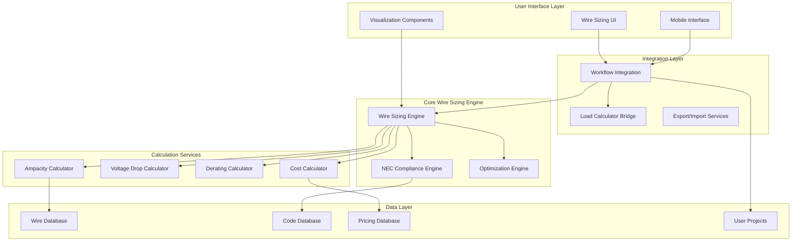
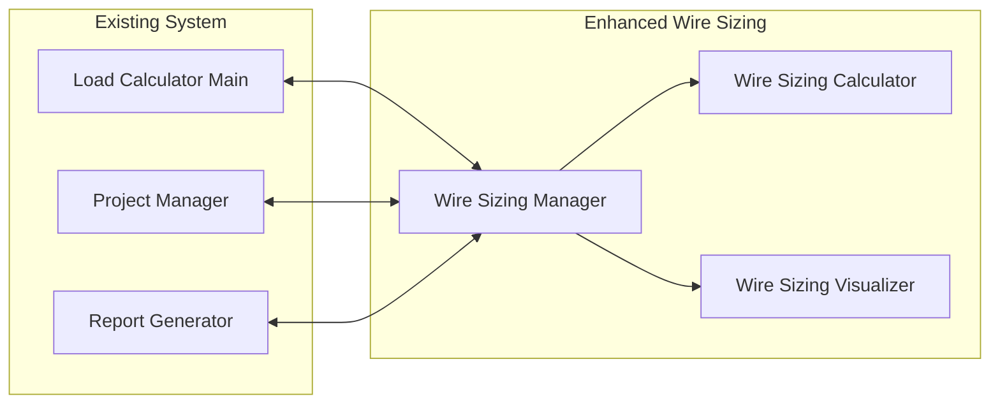

# Enhanced Wire Sizing Feature Design

## Overview

The Enhanced Wire Sizing Feature transforms the existing standalone wire sizing calculator into a comprehensive, integrated electrical design system. The design focuses on seamless workflow integration, advanced calculation accuracy, intelligent automation, and professional-grade reporting capabilities.

The system will be built as a modular architecture that integrates deeply with the existing load calculation workflow while providing standalone capabilities for dedicated wire sizing tasks. The design emphasizes real-time calculations, visual feedback, and comprehensive NEC compliance validation.

## Architecture

### High-Level System Architecture



### Component Integration Architecture



## Components and Interfaces

### 1. Wire Sizing Manager (WSM)

**Purpose:** Central orchestrator for all wire sizing operations and workflow integration.

**Key Responsibilities:**
- Coordinate between load calculations and wire sizing
- Manage project-level wire sizing data
- Handle bulk operations across multiple circuits
- Integrate with reporting and export systems

**Interface:**
```typescript
interface WireSizingManager {
  // Project Integration
  initializeFromProject(projectId: string): Promise<WireSizingProject>;
  syncWithLoadCalculations(loadData: LoadCalculationResult[]): Promise<void>;
  saveToProject(projectId: string, wireSizingData: WireSizingProject): Promise<void>;
  
  // Circuit Management
  addCircuit(circuit: CircuitDefinition): Promise<CircuitWireSizing>;
  updateCircuit(circuitId: string, updates: Partial<CircuitDefinition>): Promise<void>;
  removeCircuit(circuitId: string): Promise<void>;
  bulkUpdateCircuits(updates: BulkCircuitUpdate[]): Promise<void>;
  
  // Calculation Orchestration
  calculateAllCircuits(): Promise<WireSizingResults>;
  validateAllCircuits(): Promise<ValidationResults>;
  optimizeAllCircuits(criteria: OptimizationCriteria): Promise<OptimizationResults>;
  
  // Export/Import
  exportWireSchedule(format: ExportFormat): Promise<ExportResult>;
  importCircuitData(data: ImportData): Promise<ImportResult>;
}
```

### 2. Enhanced Wire Sizing Calculator (WSC)

**Purpose:** Advanced calculation engine with comprehensive NEC compliance and optimization.

**Key Features:**
- Multi-code year support (2017, 2020, 2023 NEC)
- Real-time calculation updates
- Advanced derating calculations
- Specialized load type handling
- Cost optimization algorithms

**Interface:**
```typescript
interface EnhancedWireSizingCalculator {
  // Core Calculations
  calculateWireSize(params: WireSizingParameters): WireSizingResult;
  calculateVoltageDrop(params: VoltageDropParameters): VoltageDropResult;
  calculateAmpacity(params: AmpacityParameters): AmpacityResult;
  
  // Advanced Calculations
  calculateMotorCircuit(params: MotorCircuitParameters): MotorWireSizingResult;
  calculateEVSECircuit(params: EVSECircuitParameters): EVSEWireSizingResult;
  calculateSolarCircuit(params: SolarCircuitParameters): SolarWireSizingResult;
  
  // Optimization
  optimizeWireSelection(params: OptimizationParameters): WireOptimizationResult;
  compareWireOptions(options: WireOption[]): WireComparisonResult;
  
  // Validation
  validateNECCompliance(circuit: CircuitDefinition): NECValidationResult;
  validateInstallationMethod(params: InstallationParameters): InstallationValidationResult;
}
```

### 3. Wire Sizing Visualizer (WSV)

**Purpose:** Interactive visualization and user interface components for wire sizing.

**Key Features:**
- Real-time interactive charts
- Voltage drop visualization
- Cost comparison charts
- Circuit topology diagrams
- Mobile-optimized interfaces

**Interface:**
```typescript
interface WireSizingVisualizer {
  // Chart Generation
  generateAmpacityChart(data: AmpacityChartData): ChartComponent;
  generateVoltageDropChart(data: VoltageDropChartData): ChartComponent;
  generateCostComparisonChart(data: CostComparisonData): ChartComponent;
  
  // Interactive Components
  createWireSizingForm(config: FormConfiguration): FormComponent;
  createCircuitDiagram(circuit: CircuitDefinition): DiagramComponent;
  createMobileInterface(config: MobileConfiguration): MobileComponent;
  
  // Export Visualizations
  exportChart(chart: ChartComponent, format: ImageFormat): Promise<ExportResult>;
  generateVisualReport(data: ReportData): Promise<VisualReport>;
}
```

### 4. NEC Compliance Engine

**Purpose:** Comprehensive NEC code compliance checking and validation.

**Key Features:**
- Multi-year code support
- Contextual code references
- Violation detection and correction suggestions
- Compliance documentation generation

**Interface:**
```typescript
interface NECComplianceEngine {
  // Compliance Checking
  checkCompliance(circuit: CircuitDefinition, codeYear: NECCodeYear): ComplianceResult;
  validateWireSize(params: WireSizeValidationParams): WireSizeValidationResult;
  validateInstallation(params: InstallationValidationParams): InstallationValidationResult;
  
  // Code References
  getApplicableCodes(circuitType: CircuitType): NECReference[];
  getCodeExplanation(codeSection: string): CodeExplanation;
  
  // Documentation
  generateComplianceReport(circuits: CircuitDefinition[]): ComplianceReport;
  generateCodeJustification(decision: DesignDecision): CodeJustification;
}
```

## Data Models

### Core Data Structures

```typescript
// Enhanced Circuit Definition
interface CircuitDefinition {
  id: string;
  name: string;
  description?: string;
  
  // Electrical Parameters
  load: number; // amperes
  voltage: number; // volts
  phases: 1 | 3;
  powerFactor: number;
  
  // Load Characteristics
  loadType: LoadType;
  isContinuous: boolean;
  isMotorLoad: boolean;
  isEVSE: boolean;
  isSolar: boolean;
  
  // Installation Parameters
  length: number; // feet
  installationMethod: InstallationMethod;
  ambientTemperature: number; // celsius
  altitude: number; // feet above sea level
  
  // Conductor Specifications
  conductorMaterial: 'copper' | 'aluminum';
  temperatureRating: '60C' | '75C' | '90C';
  conductorCount: number;
  
  // Conduit/Raceway
  conduitType?: ConduitType;
  conduitSize?: string;
  conduitFillPercentage?: number;
  
  // Special Requirements
  necCodeYear: '2017' | '2020' | '2023';
  specialRequirements?: SpecialRequirement[];
  
  // Project Integration
  projectId?: string;
  loadCalculationId?: string;
  
  // Metadata
  createdAt: Date;
  updatedAt: Date;
  createdBy: string;
}

// Comprehensive Wire Sizing Result
interface WireSizingResult {
  // Basic Results
  recommendedWireSize: string;
  ampacity: number;
  voltageDrop: number;
  voltageDropPercentage: number;
  
  // Detailed Calculations
  adjustedLoad: number;
  deratingFactors: DeratingFactors;
  temperatureCorrection: number;
  altitudeCorrection: number;
  
  // Alternative Options
  alternativeWireSizes: AlternativeWireOption[];
  
  // Cost Analysis
  materialCost: CostBreakdown;
  installationCost: CostBreakdown;
  totalCost: number;
  
  // Compliance
  necCompliance: NECComplianceResult;
  violations: ComplianceViolation[];
  warnings: ComplianceWarning[];
  
  // Optimization
  optimizationSuggestions: OptimizationSuggestion[];
  energySavingsAnalysis?: EnergySavingsAnalysis;
  
  // Documentation
  calculationWorksheet: CalculationWorksheet;
  codeReferences: NECReference[];
  
  // Metadata
  calculatedAt: Date;
  calculationVersion: string;
}

// Advanced Derating Factors
interface DeratingFactors {
  temperature: {
    factor: number;
    ambientTemp: number;
    correctionTable: string;
  };
  conduitFill: {
    factor: number;
    conductorCount: number;
    necSection: string;
  };
  altitude: {
    factor: number;
    elevation: number;
    necSection: string;
  };
  bundling: {
    factor: number;
    bundleSize: number;
    necSection: string;
  };
  combined: number;
}

// Cost Analysis Structure
interface CostBreakdown {
  materials: {
    conductor: number;
    conduit: number;
    fittings: number;
    terminations: number;
    accessories: number;
  };
  labor: {
    installation: number;
    termination: number;
    testing: number;
  };
  overhead: number;
  total: number;
  priceDate: Date;
  region: string;
}
```

### Specialized Load Type Models

```typescript
// Motor Load Specific Parameters
interface MotorCircuitParameters extends CircuitDefinition {
  motorType: 'single-phase' | 'three-phase' | 'wound-rotor';
  motorHP: number;
  motorFLA: number; // Full Load Amperes
  motorLRA: number; // Locked Rotor Amperes
  motorServiceFactor: number;
  startingMethod: 'across-line' | 'reduced-voltage' | 'soft-start';
  overloadProtection: OverloadProtectionType;
}

// EVSE Circuit Specific Parameters
interface EVSECircuitParameters extends CircuitDefinition {
  evseType: 'Level1' | 'Level2' | 'Level3';
  maxChargingCurrent: number;
  loadManagementSystem: boolean;
  simultaneityFactor: number;
  necArticle625Compliance: boolean;
}

// Solar PV Circuit Specific Parameters
interface SolarCircuitParameters extends CircuitDefinition {
  pvModuleType: 'crystalline' | 'thin-film';
  maxPowerPointCurrent: number;
  shortCircuitCurrent: number;
  temperatureCoefficient: number;
  irradianceLevel: number;
  necArticle690Compliance: boolean;
}
```

## Error Handling

### Calculation Error Management

```typescript
interface CalculationError {
  type: 'validation' | 'calculation' | 'data' | 'system';
  severity: 'error' | 'warning' | 'info';
  code: string;
  message: string;
  context: Record<string, any>;
  suggestions: string[];
  necReference?: string;
}

interface ErrorHandlingStrategy {
  // Graceful Degradation
  handleMissingData(context: CalculationContext): CalculationResult;
  handleInvalidInput(input: any, validation: ValidationRule[]): ValidationResult;
  
  // Recovery Mechanisms
  recoverFromCalculationError(error: CalculationError): RecoveryAction;
  provideFallbackCalculation(params: any): FallbackResult;
  
  // User Communication
  formatErrorForUser(error: CalculationError): UserFriendlyError;
  generateErrorReport(errors: CalculationError[]): ErrorReport;
}
```

## Testing Strategy

### Unit Testing Approach

**Calculation Accuracy Testing:**
- Comprehensive test suites for all NEC table lookups
- Validation against known industry calculations
- Edge case testing for extreme parameter values
- Cross-validation with multiple calculation methods

**Code Compliance Testing:**
- Test cases for each NEC code year
- Validation of code reference accuracy
- Compliance checking algorithm verification
- Regression testing for code updates

### Integration Testing Strategy

**Workflow Integration Testing:**
- End-to-end testing of load calculation to wire sizing flow
- Project save/load functionality testing
- Export/import format validation
- Real-time update synchronization testing

**Performance Testing:**
- Bulk calculation performance benchmarks
- Real-time update responsiveness testing
- Mobile device performance optimization
- Memory usage optimization validation

### User Acceptance Testing

**Professional Workflow Testing:**
- Real-world project scenario testing
- Professional electrician user feedback
- Code inspector review and validation
- Field usage testing on mobile devices

## Implementation Phases

### Phase 1: Core Enhancement (Weeks 1-4)
- Enhanced calculation engine development
- NEC compliance engine implementation
- Basic workflow integration
- Core data model implementation

### Phase 2: Advanced Features (Weeks 5-8)
- Specialized load type support
- Cost analysis and optimization
- Advanced visualization components
- Mobile interface optimization

### Phase 3: Integration & Polish (Weeks 9-12)
- Complete workflow integration
- Export/import functionality
- Performance optimization
- Comprehensive testing and validation

### Phase 4: Advanced Capabilities (Weeks 13-16)
- AI-powered optimization suggestions
- Advanced reporting and documentation
- External system integrations
- Learning and reference system integration

## Security and Performance Considerations

### Data Security
- Encryption of project data at rest and in transit
- User authentication and authorization
- Audit logging for calculation changes
- Secure API endpoints for external integrations

### Performance Optimization
- Lazy loading of wire sizing data
- Caching of frequently used calculations
- Optimized database queries for wire tables
- Progressive web app capabilities for offline use

### Scalability
- Microservices architecture for calculation engines
- Horizontal scaling capabilities
- CDN integration for static resources
- Database optimization for large project datasets