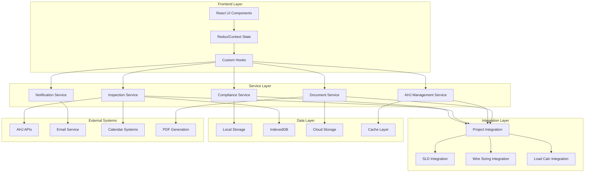

# Design Document

## Overview

The Inspection and Code Compliance Management system is designed as a comprehensive project lifecycle management platform that extends the existing Professional Load Calculator into a complete electrical project workflow solution. The system integrates seamlessly with existing load calculations, wire sizing, and SLD features while adding sophisticated compliance tracking, inspection management, and AHJ coordination capabilities.

The architecture follows a modular, service-oriented design that maintains separation of concerns while providing tight integration with existing project data structures. The system is built to scale from individual contractors to large electrical engineering firms with multi-project, multi-user workflows.

## Architecture

### High-Level System Architecture



### Data Flow Architecture

The system follows a unidirectional data flow pattern with clear separation between compliance data, project data, and external integrations:

1. **Project Data Integration**: Compliance data is tightly coupled with existing project structures
2. **Event-Driven Updates**: Changes in load calculations or SLD diagrams trigger compliance re-validation
3. **Asynchronous Processing**: Long-running compliance checks and document generation happen in background
4. **Offline-First Design**: Core compliance features work offline with sync when connected

## Components and Interfaces

### Core Data Models

#### ComplianceProject Interface
```typescript
interface ComplianceProject extends ProjectData {
  compliance: {
    id: string;
    projectId: string;
    ahjId: string;
    status: ComplianceStatus;
    codeYear: '2017' | '2020' | '2023';
    localAmendments: LocalAmendment[];
    validationResults: ValidationResult[];
    inspections: Inspection[];
    issues: ComplianceIssue[];
    documents: ComplianceDocument[];
    auditTrail: AuditEntry[];
    created: Date;
    lastValidated: Date;
    nextInspectionDate?: Date;
  };
}
```

#### AHJ (Authority Having Jurisdiction) Management
```typescript
interface AHJ {
  id: string;
  name: string;
  jurisdiction: string;
  contactInfo: {
    address: string;
    phone: string;
    email: string;
    website?: string;
    officeHours: string;
  };
  requirements: {
    codeYear: '2017' | '2020' | '2023';
    localAmendments: LocalAmendment[];
    submissionFormat: 'pdf' | 'dwg' | 'both';
    requiredDocuments: string[];
    inspectionTypes: InspectionType[];
    processingTime: number; // days
  };
  preferences: {
    preferredContactMethod: 'email' | 'phone' | 'portal';
    schedulingSystem?: 'online' | 'phone' | 'email';
    digitalSubmission: boolean;
  };
  performance: {
    averageApprovalTime: number;
    commonRejectionReasons: string[];
    inspectorNotes: string[];
  };
}
```

#### Inspection Management
```typescript
interface Inspection {
  id: string;
  projectId: string;
  type: InspectionType;
  status: InspectionStatus;
  scheduledDate?: Date;
  completedDate?: Date;
  inspector: {
    name: string;
    contact: string;
    preferences?: string[];
  };
  checklist: ChecklistItem[];
  findings: InspectionFinding[];
  result: 'pass' | 'fail' | 'conditional' | 'pending';
  nextSteps: string[];
  documents: string[]; // Document IDs
  notes: string;
  followUpRequired: boolean;
  followUpDate?: Date;
}

type InspectionType = 
  | 'rough_electrical'
  | 'final_electrical' 
  | 'service_upgrade'
  | 'solar_pv'
  | 'energy_storage'
  | 'evse'
  | 'special_equipment';

type InspectionStatus = 
  | 'scheduled'
  | 'in_progress'
  | 'completed'
  | 'cancelled'
  | 'rescheduled';
```

#### Compliance Validation System
```typescript
interface ValidationResult {
  id: string;
  projectId: string;
  validationType: 'nec_compliance' | 'local_code' | 'ahj_requirements';
  status: 'pass' | 'fail' | 'warning';
  validatedAt: Date;
  validatedBy: 'system' | 'user';
  results: ValidationCheck[];
  overallScore: number; // 0-100
  criticalIssues: number;
  warnings: number;
  recommendations: string[];
}

interface ValidationCheck {
  id: string;
  category: string;
  description: string;
  necReference?: string;
  status: 'pass' | 'fail' | 'warning' | 'not_applicable';
  details: string;
  suggestedFix?: string;
  autoFixable: boolean;
  severity: 'critical' | 'major' | 'minor' | 'info';
}
```

### Service Layer Components

#### ComplianceService
Primary service for managing code compliance validation and tracking:

```typescript
class ComplianceService {
  // Validation Methods
  async validateProject(projectId: string): Promise<ValidationResult>
  async validateNECCompliance(projectData: ProjectData): Promise<ValidationCheck[]>
  async validateLocalCodes(projectData: ProjectData, ahjId: string): Promise<ValidationCheck[]>
  async validateWireSizing(wireSizingData: any): Promise<ValidationCheck[]>
  async validateSLDCompliance(sldDiagram: SLDDiagram): Promise<ValidationCheck[]>
  
  // Issue Management
  async createIssue(issue: ComplianceIssue): Promise<string>
  async updateIssue(issueId: string, updates: Partial<ComplianceIssue>): Promise<boolean>
  async resolveIssue(issueId: string, resolution: IssueResolution): Promise<boolean>
  async getProjectIssues(projectId: string): Promise<ComplianceIssue[]>
  
  // Reporting
  async generateComplianceReport(projectId: string): Promise<ComplianceReport>
  async exportComplianceData(projectId: string, format: 'pdf' | 'json' | 'csv'): Promise<Blob>
}
```

#### InspectionService
Manages inspection scheduling, tracking, and coordination:

```typescript
class InspectionService {
  // Scheduling
  async scheduleInspection(inspection: Partial<Inspection>): Promise<string>
  async rescheduleInspection(inspectionId: string, newDate: Date): Promise<boolean>
  async cancelInspection(inspectionId: string, reason: string): Promise<boolean>
  
  // Checklist Management
  async generateChecklist(projectId: string, inspectionType: InspectionType): Promise<ChecklistItem[]>
  async updateChecklistItem(itemId: string, status: boolean, notes?: string): Promise<boolean>
  async getInspectionReadiness(projectId: string): Promise<ReadinessScore>
  
  // Communication
  async sendInspectionReminder(inspectionId: string): Promise<boolean>
  async notifyInspectionComplete(inspectionId: string): Promise<boolean>
  async requestReinspection(inspectionId: string, corrections: string[]): Promise<string>
}
```

#### AHJService
Manages Authority Having Jurisdiction data and interactions:

```typescript
class AHJService {
  // AHJ Management
  async getAHJByLocation(address: string): Promise<AHJ[]>
  async createAHJ(ahjData: Partial<AHJ>): Promise<string>
  async updateAHJ(ahjId: string, updates: Partial<AHJ>): Promise<boolean>
  async getAHJRequirements(ahjId: string): Promise<AHJRequirements>
  
  // Submission Management
  async formatForSubmission(projectId: string, ahjId: string): Promise<SubmissionPackage>
  async trackSubmission(submissionId: string): Promise<SubmissionStatus>
  async updateSubmissionStatus(submissionId: string, status: SubmissionStatus): Promise<boolean>
  
  // Performance Tracking
  async recordAHJPerformance(ahjId: string, metrics: PerformanceMetrics): Promise<boolean>
  async getAHJAnalytics(ahjId: string): Promise<AHJAnalytics>
}
```

### UI Component Architecture

#### Main Compliance Dashboard
```typescript
interface ComplianceDashboardProps {
  projectId: string;
  onNavigate: (section: string) => void;
}

const ComplianceDashboard: React.FC<ComplianceDashboardProps> = ({
  projectId,
  onNavigate
}) => {
  // Dashboard showing:
  // - Overall compliance status
  // - Active inspections
  // - Outstanding issues
  // - Upcoming deadlines
  // - Quick actions
};
```

#### Inspection Management Interface
```typescript
interface InspectionManagerProps {
  projectId: string;
  inspections: Inspection[];
  onScheduleInspection: (inspection: Partial<Inspection>) => void;
  onUpdateInspection: (id: string, updates: Partial<Inspection>) => void;
}

const InspectionManager: React.FC<InspectionManagerProps> = ({
  projectId,
  inspections,
  onScheduleInspection,
  onUpdateInspection
}) => {
  // Interface for:
  // - Viewing scheduled inspections
  // - Scheduling new inspections
  // - Managing inspection checklists
  // - Recording inspection results
  // - Tracking follow-up actions
};
```

#### Compliance Validation Panel
```typescript
interface ComplianceValidationProps {
  projectId: string;
  validationResults: ValidationResult[];
  onRunValidation: () => void;
  onResolveIssue: (issueId: string, resolution: IssueResolution) => void;
}

const ComplianceValidation: React.FC<ComplianceValidationProps> = ({
  projectId,
  validationResults,
  onRunValidation,
  onResolveIssue
}) => {
  // Panel showing:
  // - Validation status overview
  // - Detailed compliance checks
  // - Issue resolution interface
  // - Code reference links
  // - Auto-fix suggestions
};
```

## Data Models

### Extended Project Data Structure

The compliance system extends the existing `ProjectData` interface without breaking changes:

```typescript
interface ExtendedProjectData extends ProjectData {
  compliance?: {
    // Core compliance data
    status: ComplianceStatus;
    ahjId?: string;
    codeYear: '2017' | '2020' | '2023';
    
    // Validation tracking
    lastValidation?: Date;
    validationResults: ValidationResult[];
    complianceScore: number; // 0-100
    
    // Issue tracking
    activeIssues: ComplianceIssue[];
    resolvedIssues: ComplianceIssue[];
    
    // Inspection management
    inspections: Inspection[];
    nextInspectionDate?: Date;
    
    // Document management
    documents: ComplianceDocument[];
    submissionHistory: Submission[];
    
    // Audit trail
    auditTrail: AuditEntry[];
  };
}
```

### Compliance-Specific Data Models

#### ComplianceIssue
```typescript
interface ComplianceIssue {
  id: string;
  projectId: string;
  type: 'nec_violation' | 'local_code' | 'ahj_requirement' | 'design_error' | 'documentation';
  severity: 'critical' | 'major' | 'minor' | 'info';
  status: 'open' | 'in_progress' | 'resolved' | 'deferred';
  
  // Issue details
  title: string;
  description: string;
  codeReference?: string;
  location?: string; // Where in the project/diagram
  
  // Assignment and tracking
  assignedTo?: string;
  createdBy: string;
  createdAt: Date;
  dueDate?: Date;
  
  // Resolution
  resolution?: IssueResolution;
  resolvedAt?: Date;
  resolvedBy?: string;
  
  // Related data
  relatedComponents?: string[]; // SLD component IDs
  relatedCalculations?: string[]; // Load calculation IDs
  attachments: string[]; // Document IDs
  
  // Communication
  comments: IssueComment[];
  notifications: NotificationSettings;
}
```

#### ComplianceDocument
```typescript
interface ComplianceDocument {
  id: string;
  projectId: string;
  type: 'permit_application' | 'inspection_report' | 'compliance_certificate' | 'correction_notice' | 'ahj_correspondence';
  
  // Document metadata
  name: string;
  description?: string;
  version: string;
  status: 'draft' | 'submitted' | 'approved' | 'rejected' | 'archived';
  
  // File information
  fileUrl?: string;
  fileSize?: number;
  mimeType?: string;
  
  // Tracking
  createdAt: Date;
  createdBy: string;
  submittedAt?: Date;
  submittedTo?: string; // AHJ ID
  approvedAt?: Date;
  approvedBy?: string;
  
  // Relationships
  relatedInspections: string[];
  relatedIssues: string[];
  supersedes?: string; // Previous document version
  
  // Approval workflow
  approvalWorkflow?: ApprovalWorkflow;
  signatures: DocumentSignature[];
}
```

## Error Handling

### Validation Error Management
The system implements comprehensive error handling for compliance validation:

```typescript
class ComplianceError extends Error {
  constructor(
    message: string,
    public code: string,
    public severity: 'critical' | 'major' | 'minor',
    public codeReference?: string,
    public suggestedFix?: string
  ) {
    super(message);
    this.name = 'ComplianceError';
  }
}

class ValidationEngine {
  async validateWithErrorHandling(projectData: ProjectData): Promise<ValidationResult> {
    try {
      const results = await this.runValidation(projectData);
      return results;
    } catch (error) {
      if (error instanceof ComplianceError) {
        // Handle compliance-specific errors
        return this.createErrorResult(error);
      } else {
        // Handle unexpected errors
        console.error('Unexpected validation error:', error);
        return this.createFailsafeResult();
      }
    }
  }
}
```

### Offline Error Handling
```typescript
class OfflineComplianceManager {
  private pendingValidations: Map<string, ValidationRequest> = new Map();
  
  async queueValidation(projectId: string, data: ProjectData): Promise<void> {
    if (!navigator.onLine) {
      this.pendingValidations.set(projectId, { projectId, data, timestamp: Date.now() });
      return;
    }
    
    try {
      await this.complianceService.validateProject(projectId);
    } catch (error) {
      // Queue for retry when online
      this.pendingValidations.set(projectId, { projectId, data, timestamp: Date.now() });
    }
  }
  
  async processPendingValidations(): Promise<void> {
    for (const [projectId, request] of this.pendingValidations) {
      try {
        await this.complianceService.validateProject(projectId);
        this.pendingValidations.delete(projectId);
      } catch (error) {
        console.warn(`Failed to process pending validation for ${projectId}:`, error);
      }
    }
  }
}
```

## Testing Strategy

### Unit Testing Strategy
```typescript
// Compliance Service Tests
describe('ComplianceService', () => {
  describe('validateNECCompliance', () => {
    it('should validate wire sizing against NEC requirements', async () => {
      const mockProjectData = createMockProjectData();
      const result = await complianceService.validateNECCompliance(mockProjectData);
      
      expect(result).toHaveLength(greaterThan(0));
      expect(result[0]).toHaveProperty('necReference');
      expect(result[0].status).toBeOneOf(['pass', 'fail', 'warning']);
    });
    
    it('should handle missing project data gracefully', async () => {
      const result = await complianceService.validateNECCompliance(null);
      expect(result).toEqual([]);
    });
  });
});

// Integration Tests
describe('Compliance Integration', () => {
  it('should update compliance status when load calculations change', async () => {
    const project = await createTestProject();
    const initialCompliance = await complianceService.getComplianceStatus(project.id);
    
    // Modify load calculations
    await loadCalculatorService.updateLoad(project.id, mockLoadChange);
    
    // Verify compliance is re-validated
    const updatedCompliance = await complianceService.getComplianceStatus(project.id);
    expect(updatedCompliance.lastValidation).toBeAfter(initialCompliance.lastValidation);
  });
});
```

### End-to-End Testing
```typescript
// E2E Test Scenarios
describe('Compliance Workflow E2E', () => {
  it('should complete full inspection workflow', async () => {
    // Create project with compliance issues
    const project = await createProjectWithIssues();
    
    // Navigate to compliance dashboard
    await page.goto(`/projects/${project.id}/compliance`);
    
    // Verify issues are displayed
    await expect(page.locator('[data-testid="compliance-issues"]')).toBeVisible();
    
    // Resolve issues
    await page.click('[data-testid="resolve-issue-btn"]');
    await page.fill('[data-testid="resolution-notes"]', 'Updated wire sizing per NEC 310.15');
    await page.click('[data-testid="save-resolution"]');
    
    // Schedule inspection
    await page.click('[data-testid="schedule-inspection"]');
    await page.selectOption('[data-testid="inspection-type"]', 'final_electrical');
    await page.fill('[data-testid="inspection-date"]', '2024-12-01');
    await page.click('[data-testid="confirm-schedule"]');
    
    // Verify inspection is scheduled
    await expect(page.locator('[data-testid="scheduled-inspections"]')).toContainText('final_electrical');
  });
});
```

### Performance Testing
```typescript
describe('Compliance Performance', () => {
  it('should validate large projects within acceptable time', async () => {
    const largeProject = await createLargeProject(100); // 100 components
    
    const startTime = performance.now();
    const result = await complianceService.validateProject(largeProject.id);
    const endTime = performance.now();
    
    expect(endTime - startTime).toBeLessThan(5000); // 5 seconds max
    expect(result.validationResults).toHaveLength(greaterThan(0));
  });
  
  it('should handle concurrent validations efficiently', async () => {
    const projects = await Promise.all([
      createTestProject(),
      createTestProject(),
      createTestProject()
    ]);
    
    const startTime = performance.now();
    const results = await Promise.all(
      projects.map(p => complianceService.validateProject(p.id))
    );
    const endTime = performance.now();
    
    expect(results).toHaveLength(3);
    expect(endTime - startTime).toBeLessThan(10000); // 10 seconds for 3 projects
  });
});
```

## Integration Points

### Load Calculator Integration
```typescript
class LoadCalculatorComplianceIntegration {
  async onLoadCalculationChange(projectId: string, calculationData: any): Promise<void> {
    // Trigger compliance re-validation when loads change
    const validationResult = await this.complianceService.validateProject(projectId);
    
    // Update project compliance status
    await this.projectService.updateProject(projectId, {
      compliance: {
        lastValidation: new Date(),
        validationResults: [validationResult],
        complianceScore: this.calculateComplianceScore(validationResult)
      }
    });
    
    // Notify user of compliance changes
    if (validationResult.criticalIssues > 0) {
      await this.notificationService.sendComplianceAlert(projectId, validationResult);
    }
  }
}
```

### SLD Integration
```typescript
class SLDComplianceIntegration {
  async validateSLDCompliance(diagram: SLDDiagram): Promise<ValidationCheck[]> {
    const checks: ValidationCheck[] = [];
    
    // Validate NEC labeling requirements
    checks.push(...await this.validateNECLabeling(diagram));
    
    // Validate component specifications
    checks.push(...await this.validateComponentSpecs(diagram));
    
    // Validate connection requirements
    checks.push(...await this.validateConnections(diagram));
    
    // Validate grounding and bonding
    checks.push(...await this.validateGroundingBonding(diagram));
    
    return checks;
  }
  
  private async validateNECLabeling(diagram: SLDDiagram): Promise<ValidationCheck[]> {
    const checks: ValidationCheck[] = [];
    
    // Check for required disconnect labels
    const disconnects = diagram.components.filter(c => c.type.includes('disconnect'));
    for (const disconnect of disconnects) {
      if (!disconnect.necLabels || disconnect.necLabels.length === 0) {
        checks.push({
          id: `nec-label-${disconnect.id}`,
          category: 'NEC Labeling',
          description: 'Disconnect switch missing required NEC labeling',
          necReference: '690.13(B)',
          status: 'fail',
          details: 'All disconnect switches must be labeled per NEC requirements',
          suggestedFix: 'Add appropriate disconnect labeling to component',
          autoFixable: true,
          severity: 'major'
        });
      }
    }
    
    return checks;
  }
}
```

### Wire Sizing Integration
```typescript
class WireSizingComplianceIntegration {
  async validateWireSizing(wireSizingData: any): Promise<ValidationCheck[]> {
    const checks: ValidationCheck[] = [];
    
    // Validate ampacity calculations
    checks.push(...await this.validateAmpacity(wireSizingData));
    
    // Validate voltage drop compliance
    checks.push(...await this.validateVoltageDrop(wireSizingData));
    
    // Validate conduit fill
    checks.push(...await this.validateConduitFill(wireSizingData));
    
    // Validate termination requirements
    checks.push(...await this.validateTerminations(wireSizingData));
    
    return checks;
  }
}
```

This comprehensive design provides a robust foundation for the Inspection and Code Compliance Management system while maintaining seamless integration with existing project workflows and data structures.