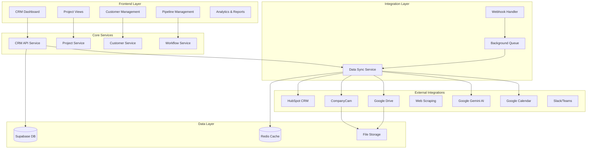

# Design Document - Integrated CRM System

## Overview

The Integrated CRM System will be a comprehensive customer relationship management solution built directly into the Professional Load Calculator application. It will provide electrical contractors with a complete workflow management system that tracks projects from initial lead through completed installation, while seamlessly integrating with existing application features and external services.

## Architecture

### High-Level Architecture



### Technology Stack Integration

- **Frontend**: React 18 + TypeScript with new CRM components
- **State Management**: React Context + Zustand for CRM state
- **Backend**: Express.js with new CRM API endpoints
- **Database**: Supabase with new CRM tables
- **Caching**: Redis for external API response caching
- **Queue**: Bull Queue for background job processing
- **File Storage**: Google Drive + local storage for documents/images

## Components and Interfaces

### Frontend Components

#### 1. CRM Navigation Tab
```typescript
interface CRMTabProps {
  activeView: 'dashboard' | 'customers' | 'projects' | 'pipeline' | 'analytics';
  onViewChange: (view: string) => void;
}
```

#### 2. CRM Dashboard
```typescript
interface CRMDashboardProps {
  metrics: {
    totalLeads: number;
    activeProjects: number;
    monthlyRevenue: number;
    conversionRate: number;
  };
  recentActivity: Activity[];
  upcomingTasks: Task[];
}
```

#### 3. Customer Management
```typescript
interface Customer {
  id: string;
  name: string;
  email: string;
  phone: string;
  address: Address;
  company?: string;
  source: 'referral' | 'website' | 'social' | 'advertising' | 'other';
  tags: string[];
  customFields: Record<string, any>;
  hubspotId?: string;
  createdAt: Date;
  updatedAt: Date;
}

interface CustomerListProps {
  customers: Customer[];
  onCustomerSelect: (customer: Customer) => void;
  onCustomerCreate: () => void;
  searchQuery: string;
  filters: CustomerFilters;
}
```

#### 4. Project Pipeline
```typescript
interface ProjectStage {
  id: string;
  name: string;
  order: number;
  color: string;
  automations: StageAutomation[];
}

interface ProjectCard {
  id: string;
  customerId: string;
  name: string;
  stage: ProjectStage;
  value: number;
  probability: number;
  expectedCloseDate: Date;
  lastActivity: Date;
  assignedTo: string;
}

interface PipelineViewProps {
  stages: ProjectStage[];
  projects: ProjectCard[];
  onProjectMove: (projectId: string, newStageId: string) => void;
  onProjectEdit: (project: ProjectCard) => void;
}
```

#### 5. Integration Panels
```typescript
interface IntegrationStatus {
  service: string;
  connected: boolean;
  lastSync: Date;
  syncStatus: 'success' | 'error' | 'pending';
  errorMessage?: string;
}

interface IntegrationPanelProps {
  integrations: IntegrationStatus[];
  onConnect: (service: string) => void;
  onDisconnect: (service: string) => void;
  onSync: (service: string) => void;
}
```

### Backend API Endpoints

#### CRM Core Endpoints
```typescript
// Customer Management
GET    /api/crm/customers
POST   /api/crm/customers
GET    /api/crm/customers/:id
PUT    /api/crm/customers/:id
DELETE /api/crm/customers/:id

// Project Management
GET    /api/crm/projects
POST   /api/crm/projects
GET    /api/crm/projects/:id
PUT    /api/crm/projects/:id
DELETE /api/crm/projects/:id
POST   /api/crm/projects/:id/stage
POST   /api/crm/projects/:id/notes
GET    /api/crm/projects/:id/timeline

// Pipeline Management
GET    /api/crm/pipeline/stages
POST   /api/crm/pipeline/stages
PUT    /api/crm/pipeline/stages/:id
DELETE /api/crm/pipeline/stages/:id
GET    /api/crm/pipeline/analytics

// Activity & Tasks
GET    /api/crm/activities
POST   /api/crm/activities
GET    /api/crm/tasks
POST   /api/crm/tasks
PUT    /api/crm/tasks/:id
```

#### Integration Endpoints
```typescript
// HubSpot Integration
POST   /api/crm/integrations/hubspot/connect
POST   /api/crm/integrations/hubspot/sync
GET    /api/crm/integrations/hubspot/status
POST   /api/crm/integrations/hubspot/webhook

// Google Drive Integration
POST   /api/crm/integrations/gdrive/connect
GET    /api/crm/integrations/gdrive/folders/:projectId
POST   /api/crm/integrations/gdrive/upload
GET    /api/crm/integrations/gdrive/files/:projectId

// CompanyCam Integration
POST   /api/crm/integrations/companycam/connect
GET    /api/crm/integrations/companycam/photos/:projectId
POST   /api/crm/integrations/companycam/webhook

// AI & Analytics
POST   /api/crm/ai/insights
POST   /api/crm/ai/communication-assist
GET    /api/crm/analytics/dashboard
GET    /api/crm/analytics/reports
```

## Data Models

### Database Schema

#### CRM Tables
```sql
-- Customers table
CREATE TABLE crm_customers (
  id UUID PRIMARY KEY DEFAULT gen_random_uuid(),
  user_id UUID REFERENCES auth.users(id),
  name VARCHAR(255) NOT NULL,
  email VARCHAR(255),
  phone VARCHAR(50),
  company VARCHAR(255),
  address JSONB,
  source VARCHAR(50),
  tags TEXT[],
  custom_fields JSONB DEFAULT '{}',
  hubspot_id VARCHAR(100),
  external_ids JSONB DEFAULT '{}',
  created_at TIMESTAMP WITH TIME ZONE DEFAULT NOW(),
  updated_at TIMESTAMP WITH TIME ZONE DEFAULT NOW()
);

-- CRM Projects table (extends existing projects)
CREATE TABLE crm_projects (
  id UUID PRIMARY KEY DEFAULT gen_random_uuid(),
  project_id UUID REFERENCES projects(id),
  customer_id UUID REFERENCES crm_customers(id),
  stage_id UUID REFERENCES crm_stages(id),
  value DECIMAL(10,2),
  probability INTEGER DEFAULT 50,
  expected_close_date DATE,
  assigned_to UUID REFERENCES auth.users(id),
  source VARCHAR(50),
  priority VARCHAR(20) DEFAULT 'medium',
  tags TEXT[],
  custom_fields JSONB DEFAULT '{}',
  hubspot_deal_id VARCHAR(100),
  created_at TIMESTAMP WITH TIME ZONE DEFAULT NOW(),
  updated_at TIMESTAMP WITH TIME ZONE DEFAULT NOW()
);

-- Pipeline stages
CREATE TABLE crm_stages (
  id UUID PRIMARY KEY DEFAULT gen_random_uuid(),
  user_id UUID REFERENCES auth.users(id),
  name VARCHAR(100) NOT NULL,
  description TEXT,
  order_index INTEGER NOT NULL,
  color VARCHAR(7) DEFAULT '#3B82F6',
  is_closed BOOLEAN DEFAULT FALSE,
  automations JSONB DEFAULT '[]',
  created_at TIMESTAMP WITH TIME ZONE DEFAULT NOW()
);

-- Activities and timeline
CREATE TABLE crm_activities (
  id UUID PRIMARY KEY DEFAULT gen_random_uuid(),
  user_id UUID REFERENCES auth.users(id),
  project_id UUID REFERENCES crm_projects(id),
  customer_id UUID REFERENCES crm_customers(id),
  type VARCHAR(50) NOT NULL,
  title VARCHAR(255) NOT NULL,
  description TEXT,
  metadata JSONB DEFAULT '{}',
  created_at TIMESTAMP WITH TIME ZONE DEFAULT NOW()
);

-- Tasks and reminders
CREATE TABLE crm_tasks (
  id UUID PRIMARY KEY DEFAULT gen_random_uuid(),
  user_id UUID REFERENCES auth.users(id),
  project_id UUID REFERENCES crm_projects(id),
  customer_id UUID REFERENCES crm_customers(id),
  title VARCHAR(255) NOT NULL,
  description TEXT,
  due_date TIMESTAMP WITH TIME ZONE,
  priority VARCHAR(20) DEFAULT 'medium',
  status VARCHAR(20) DEFAULT 'pending',
  assigned_to UUID REFERENCES auth.users(id),
  created_at TIMESTAMP WITH TIME ZONE DEFAULT NOW(),
  completed_at TIMESTAMP WITH TIME ZONE
);

-- Integration sync status
CREATE TABLE crm_integrations (
  id UUID PRIMARY KEY DEFAULT gen_random_uuid(),
  user_id UUID REFERENCES auth.users(id),
  service VARCHAR(50) NOT NULL,
  config JSONB NOT NULL,
  status VARCHAR(20) DEFAULT 'active',
  last_sync TIMESTAMP WITH TIME ZONE,
  sync_status VARCHAR(20),
  error_message TEXT,
  created_at TIMESTAMP WITH TIME ZONE DEFAULT NOW()
);
```

### Service Interfaces

#### CRM Service
```typescript
interface CRMService {
  // Customer management
  createCustomer(data: CreateCustomerRequest): Promise<Customer>;
  updateCustomer(id: string, data: UpdateCustomerRequest): Promise<Customer>;
  getCustomer(id: string): Promise<Customer>;
  listCustomers(filters: CustomerFilters): Promise<Customer[]>;
  deleteCustomer(id: string): Promise<void>;

  // Project management
  createProject(data: CreateCRMProjectRequest): Promise<CRMProject>;
  updateProject(id: string, data: UpdateCRMProjectRequest): Promise<CRMProject>;
  moveProjectStage(id: string, stageId: string): Promise<CRMProject>;
  getProjectTimeline(id: string): Promise<Activity[]>;

  // Pipeline management
  getStages(): Promise<ProjectStage[]>;
  createStage(data: CreateStageRequest): Promise<ProjectStage>;
  updateStage(id: string, data: UpdateStageRequest): Promise<ProjectStage>;
  reorderStages(stageIds: string[]): Promise<void>;

  // Analytics
  getDashboardMetrics(): Promise<DashboardMetrics>;
  getReports(type: string, filters: ReportFilters): Promise<Report>;
}
```

#### Integration Services
```typescript
interface HubSpotService {
  authenticate(code: string): Promise<AuthResult>;
  syncContacts(): Promise<SyncResult>;
  syncDeals(): Promise<SyncResult>;
  createContact(customer: Customer): Promise<string>;
  updateContact(hubspotId: string, customer: Customer): Promise<void>;
  createDeal(project: CRMProject): Promise<string>;
  updateDeal(hubspotId: string, project: CRMProject): Promise<void>;
  handleWebhook(payload: HubSpotWebhook): Promise<void>;
}

interface GoogleDriveService {
  authenticate(code: string): Promise<AuthResult>;
  createProjectFolder(projectId: string, projectName: string): Promise<string>;
  uploadFile(folderId: string, file: File): Promise<DriveFile>;
  listFiles(folderId: string): Promise<DriveFile[]>;
  shareFolder(folderId: string, email: string): Promise<void>;
}

interface CompanyCamService {
  authenticate(apiKey: string): Promise<AuthResult>;
  getProjectPhotos(projectId: string): Promise<Photo[]>;
  uploadPhoto(projectId: string, photo: File, metadata: PhotoMetadata): Promise<Photo>;
  handleWebhook(payload: CompanyCamWebhook): Promise<void>;
}

interface GeminiAIService {
  generateProjectInsights(project: CRMProject): Promise<AIInsight[]>;
  improveCommunication(text: string, context: string): Promise<string>;
  analyzeMarketData(data: MarketData): Promise<MarketAnalysis>;
  generateQuoteRecommendations(project: CRMProject): Promise<QuoteRecommendation[]>;
}
```

## Error Handling

### Error Types and Responses
```typescript
interface CRMError {
  code: string;
  message: string;
  details?: any;
  timestamp: Date;
}

// Integration-specific errors
interface IntegrationError extends CRMError {
  service: string;
  retryable: boolean;
  retryAfter?: number;
}

// Common error codes
enum CRMErrorCodes {
  CUSTOMER_NOT_FOUND = 'CUSTOMER_NOT_FOUND',
  PROJECT_NOT_FOUND = 'PROJECT_NOT_FOUND',
  INTEGRATION_FAILED = 'INTEGRATION_FAILED',
  SYNC_CONFLICT = 'SYNC_CONFLICT',
  RATE_LIMIT_EXCEEDED = 'RATE_LIMIT_EXCEEDED',
  AUTHENTICATION_FAILED = 'AUTHENTICATION_FAILED',
  VALIDATION_ERROR = 'VALIDATION_ERROR'
}
```

### Error Handling Strategy
1. **Graceful Degradation**: CRM functions continue even if integrations fail
2. **Retry Logic**: Automatic retry for transient failures with exponential backoff
3. **User Notification**: Clear error messages with actionable steps
4. **Fallback Data**: Use cached data when external services are unavailable
5. **Error Logging**: Comprehensive logging for debugging and monitoring

## Testing Strategy

### Unit Testing
- **Service Layer**: Test all CRM service methods with mocked dependencies
- **Integration Layer**: Test API integrations with mock responses
- **Component Testing**: Test React components with React Testing Library
- **Utility Functions**: Test data transformation and validation functions

### Integration Testing
- **API Endpoints**: Test all CRM API endpoints with real database
- **External Services**: Test integration flows with sandbox/test environments
- **Webhook Handling**: Test webhook processing and data synchronization
- **Database Operations**: Test complex queries and transactions

### End-to-End Testing
- **Complete Workflows**: Test full customer-to-completion workflows
- **Cross-Integration**: Test data flow between multiple external services
- **Mobile Responsiveness**: Test CRM functionality on mobile devices
- **Performance**: Test with realistic data volumes and concurrent users

### Testing Tools
- **Unit Tests**: Vitest + React Testing Library
- **Integration Tests**: Supertest for API testing
- **E2E Tests**: Cypress for full workflow testing
- **Performance Tests**: Artillery for load testing
- **Mock Services**: MSW (Mock Service Worker) for API mocking

## Security Considerations

### Data Protection
- **Encryption**: All customer data encrypted at rest and in transit
- **Access Control**: Role-based permissions for CRM data access
- **Audit Logging**: Complete audit trail for all CRM operations
- **Data Retention**: Configurable data retention policies

### Integration Security
- **OAuth 2.0**: Secure authentication for all external integrations
- **API Key Management**: Secure storage and rotation of API keys
- **Webhook Verification**: Verify webhook signatures from external services
- **Rate Limiting**: Implement rate limiting for all external API calls

### Compliance
- **GDPR Compliance**: Data export, deletion, and consent management
- **SOC 2**: Security controls for customer data handling
- **Industry Standards**: Follow electrical industry data security practices

## Performance Optimization

### Frontend Performance
- **Code Splitting**: Lazy load CRM components to reduce initial bundle size
- **Virtual Scrolling**: Handle large customer/project lists efficiently
- **Optimistic Updates**: Immediate UI updates with background sync
- **Caching Strategy**: Cache frequently accessed data with React Query

### Backend Performance
- **Database Indexing**: Optimize queries with proper indexes
- **Connection Pooling**: Efficient database connection management
- **Background Jobs**: Process heavy operations asynchronously
- **API Response Caching**: Cache external API responses with Redis

### Integration Performance
- **Batch Operations**: Batch API calls to external services
- **Webhook Processing**: Async webhook processing with queues
- **Sync Optimization**: Incremental sync instead of full data refresh
- **Circuit Breaker**: Prevent cascade failures from external services

## Deployment and Monitoring

### Deployment Strategy
- **Feature Flags**: Gradual rollout of CRM features
- **Database Migrations**: Safe schema changes with rollback capability
- **Environment Parity**: Consistent configuration across environments
- **Health Checks**: Comprehensive health monitoring for all services

### Monitoring and Observability
- **Application Metrics**: Track CRM usage, performance, and errors
- **Integration Monitoring**: Monitor external service health and response times
- **User Analytics**: Track feature adoption and user behavior
- **Alerting**: Proactive alerts for system issues and integration failures

### Maintenance
- **Data Cleanup**: Regular cleanup of old activities and logs
- **Integration Updates**: Handle API version changes from external services
- **Performance Tuning**: Regular performance analysis and optimization
- **Security Updates**: Keep all dependencies and integrations updated