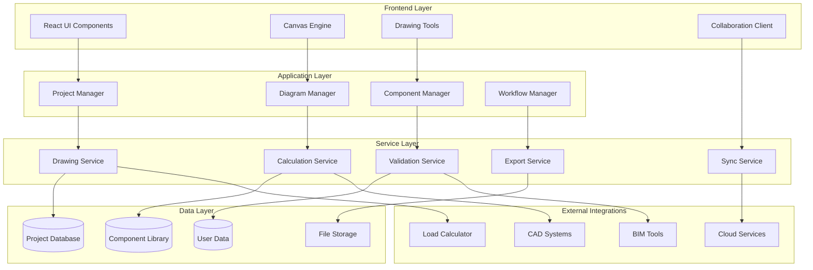

# Design Document

## Overview

The Professional SLD Enhancement transforms the existing Single Line Diagram feature into a comprehensive electrical design platform. The design follows a modular architecture with clear separation of concerns, enabling scalability, maintainability, and extensibility. The system will provide professional-grade CAD capabilities while maintaining the simplicity and integration that makes the current load calculator successful.

## Architecture

### High-Level Architecture



### Core Modules

#### 1. Canvas Engine
- **WebGL-based rendering** for high performance
- **Viewport management** with infinite canvas
- **Layer system** for organizing drawing elements
- **Hit testing** for precise selection
- **Transform management** for zoom/pan operations

#### 2. Drawing Tools System
- **Tool manager** with pluggable tool architecture
- **Precision controls** with snap-to-grid and alignment
- **Measurement tools** with real-world units
- **Selection tools** with multi-select and grouping
- **Connection tools** with intelligent routing

#### 3. Component Library System
- **Hierarchical categorization** with search and filtering
- **Symbol management** with vector graphics support
- **Specification database** with manufacturer data
- **Custom component creation** with template system
- **Version control** for component updates

#### 4. Project Management System
- **Project workspace** with folder structure
- **Workflow engine** for design phases
- **Task management** with assignments and tracking
- **Revision control** with branching and merging
- **Permission system** with role-based access

#### 5. Collaboration Engine
- **Real-time synchronization** using WebSocket connections
- **Operational transformation** for conflict resolution
- **Presence awareness** with user cursors
- **Comment system** with threaded discussions
- **Lock management** for exclusive editing

## Components and Interfaces

### Core Data Models

```typescript
interface Project {
  id: string;
  name: string;
  description: string;
  owner: string;
  team: ProjectMember[];
  settings: ProjectSettings;
  phases: ProjectPhase[];
  diagrams: Diagram[];
  created: Date;
  modified: Date;
  status: ProjectStatus;
}

interface Diagram {
  id: string;
  projectId: string;
  name: string;
  type: DiagramType;
  sheets: Sheet[];
  components: Component[];
  connections: Connection[];
  annotations: Annotation[];
  layers: Layer[];
  viewport: Viewport;
  metadata: DiagramMetadata;
}

interface Component {
  id: string;
  libraryId: string;
  name: string;
  symbol: Symbol;
  position: Point;
  rotation: number;
  properties: ComponentProperties;
  terminals: Terminal[];
  specifications: Specifications;
  necLabels: NECLabel[];
}

interface Connection {
  id: string;
  from: Terminal;
  to: Terminal;
  path: Point[];
  style: ConnectionStyle;
  specifications: WireSpecifications;
  calculations: ElectricalCalculations;
}
```

### UI Component Architecture

```typescript
// Main Application Shell
interface SLDApplication {
  projectExplorer: ProjectExplorer;
  diagramEditor: DiagramEditor;
  propertyPanel: PropertyPanel;
  toolPalette: ToolPalette;
  statusBar: StatusBar;
}

// Diagram Editor Components
interface DiagramEditor {
  canvas: CanvasComponent;
  toolbar: EditorToolbar;
  rulers: RulerComponent;
  minimap: MinimapComponent;
  layerPanel: LayerPanel;
}

// Drawing Tools
interface ToolPalette {
  selectionTools: SelectionTool[];
  drawingTools: DrawingTool[];
  measurementTools: MeasurementTool[];
  annotationTools: AnnotationTool[];
}
```

### Service Interfaces

```typescript
interface DrawingService {
  createDiagram(projectId: string, template?: string): Promise<Diagram>;
  updateDiagram(diagram: Diagram): Promise<void>;
  deleteDiagram(diagramId: string): Promise<void>;
  duplicateDiagram(diagramId: string): Promise<Diagram>;
  exportDiagram(diagramId: string, format: ExportFormat): Promise<Blob>;
}

interface ComponentLibraryService {
  getCategories(): Promise<Category[]>;
  searchComponents(query: string): Promise<Component[]>;
  getComponent(id: string): Promise<Component>;
  createCustomComponent(component: Component): Promise<string>;
  updateComponent(id: string, component: Component): Promise<void>;
}

interface CalculationService {
  calculateWireSize(connection: Connection): WireCalculation;
  validateNECCompliance(diagram: Diagram): ComplianceReport;
  calculateLoadFlow(diagram: Diagram): LoadFlowResult;
  generateSchedules(diagram: Diagram): Schedule[];
}
```

## Data Models

### Project Data Structure

```typescript
interface ProjectSettings {
  codeYear: '2017' | '2020' | '2023';
  jurisdiction: string;
  drawingStandards: DrawingStandards;
  units: 'imperial' | 'metric';
  precision: number;
  autoSave: boolean;
  collaboration: CollaborationSettings;
}

interface DrawingStandards {
  titleBlock: TitleBlockTemplate;
  layerStandards: LayerDefinition[];
  textStyles: TextStyle[];
  dimensionStyles: DimensionStyle[];
  lineTypes: LineType[];
}

interface ComponentLibrary {
  categories: Category[];
  manufacturers: Manufacturer[];
  symbols: Symbol[];
  templates: ComponentTemplate[];
}
```

### Electrical Calculation Models

```typescript
interface ElectricalCalculations {
  current: number;
  voltage: number;
  power: number;
  powerFactor: number;
  voltageDrop: VoltageDropCalculation;
  wireSize: WireSizeCalculation;
  protection: ProtectionCalculation;
}

interface NECCompliance {
  violations: NECViolation[];
  warnings: NECWarning[];
  recommendations: NECRecommendation[];
  overallCompliant: boolean;
}
```

## Error Handling

### Error Categories

1. **User Input Errors**
   - Invalid component placement
   - Electrical specification conflicts
   - Drawing constraint violations

2. **System Errors**
   - Network connectivity issues
   - File system access problems
   - Memory allocation failures

3. **Collaboration Errors**
   - Synchronization conflicts
   - Permission violations
   - Version mismatch issues

### Error Handling Strategy

```typescript
interface ErrorHandler {
  handleUserError(error: UserError): void;
  handleSystemError(error: SystemError): Promise<void>;
  handleCollaborationError(error: CollaborationError): Promise<void>;
  showErrorDialog(error: Error, context: string): void;
  logError(error: Error, context: string): void;
}

class ErrorRecoveryService {
  autoSave(): Promise<void>;
  recoverFromCrash(): Promise<Project[]>;
  syncAfterReconnect(): Promise<void>;
  resolveConflicts(conflicts: Conflict[]): Promise<Resolution[]>;
}
```

## Testing Strategy

### Unit Testing
- **Component logic testing** with Jest and React Testing Library
- **Service layer testing** with mocked dependencies
- **Calculation engine testing** with comprehensive test cases
- **Utility function testing** with edge case coverage

### Integration Testing
- **API integration testing** with real backend services
- **Database integration testing** with test databases
- **File system integration testing** with temporary directories
- **External service integration testing** with mock services

### End-to-End Testing
- **User workflow testing** with Cypress
- **Cross-browser compatibility testing**
- **Performance testing** with large diagrams
- **Collaboration testing** with multiple users

### Performance Testing
- **Load testing** with concurrent users
- **Memory usage testing** with large projects
- **Rendering performance testing** with complex diagrams
- **Network performance testing** with slow connections

## Security Considerations

### Authentication and Authorization
- **Multi-factor authentication** for enterprise users
- **Role-based access control** with granular permissions
- **Session management** with secure token handling
- **API security** with rate limiting and validation

### Data Protection
- **Encryption at rest** for sensitive project data
- **Encryption in transit** for all network communications
- **Data backup** with automated recovery procedures
- **Audit logging** for compliance requirements

### Collaboration Security
- **Real-time sync security** with encrypted WebSocket connections
- **Conflict resolution security** with user verification
- **File sharing security** with access controls
- **Version control security** with signed commits

## Performance Optimization

### Frontend Optimization
- **Virtual scrolling** for large component lists
- **Canvas optimization** with viewport culling
- **Memory management** with object pooling
- **Bundle optimization** with code splitting

### Backend Optimization
- **Database indexing** for fast queries
- **Caching strategies** for frequently accessed data
- **Connection pooling** for database connections
- **Load balancing** for high availability

### Real-time Collaboration Optimization
- **Operational transformation** for efficient conflict resolution
- **Delta synchronization** for minimal network traffic
- **Presence optimization** with throttled updates
- **Connection management** with automatic reconnection

## Deployment Architecture

### Development Environment
- **Local development** with Docker containers
- **Hot reloading** for rapid iteration
- **Mock services** for external dependencies
- **Test data seeding** for consistent testing

### Staging Environment
- **Production-like setup** with scaled-down resources
- **Integration testing** with real external services
- **Performance monitoring** with metrics collection
- **User acceptance testing** with stakeholder access

### Production Environment
- **High availability** with multiple server instances
- **Auto-scaling** based on user load
- **Monitoring and alerting** with comprehensive dashboards
- **Backup and disaster recovery** with automated procedures

## Migration Strategy

### Phase 1: Core Enhancement (Months 1-3)
- Upgrade existing canvas engine
- Implement professional drawing tools
- Enhance component library
- Add basic project management

### Phase 2: Collaboration Features (Months 4-6)
- Implement real-time synchronization
- Add user management and permissions
- Create workflow management system
- Develop mobile interfaces

### Phase 3: Advanced Features (Months 7-9)
- Add advanced calculation engines
- Implement quality assurance tools
- Create comprehensive export system
- Integrate with external systems

### Phase 4: Enterprise Features (Months 10-12)
- Add enterprise authentication
- Implement advanced security features
- Create administrative dashboards
- Optimize for large-scale deployment